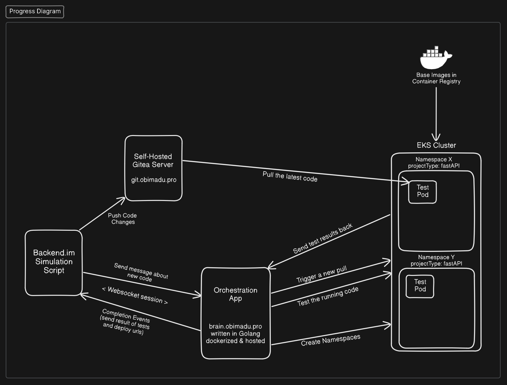
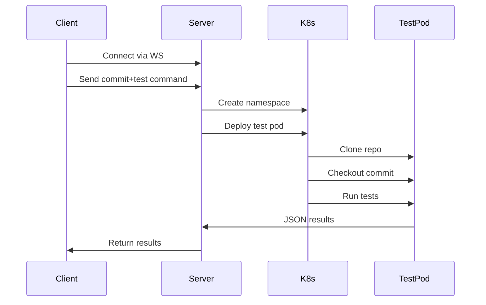

# Automated Commit Testing System for Backend.im



A distributed system for testing Git commits in isolated Kubernetes environments using WebSocket communication. Built to catch regressions before they hit production.

## ⚡️ Features

- **Real-time Test Pipeline** - WebSocket-based test orchestration
- **K8s Isolation** - Dedicated namespaces per test session
- **Commit-by-Commit Testing** - Test multiple commits in sequence
- **Custom Test Commands** - Override default test behavior
- **Failure Forensics** - Detailed error logging and output capture

## 🏗 Architecture




## 🛠 Prerequisites

- Kubernetes cluster (Docker Desktop K8s works)
- `kubectl` configured and working
- Python 3.9+ (client side)
- Go 1.18+ (server side)

## 🚀 Quick Start

### 1. Clone and Prepare

```bash
git clone https://github.com/nenyeonyema/k8s-cicd-websocket-backend-hng-stage3
cd k8s-cicd-websocket-backend-hng-stage3
```


### 3. Client Setup

```bash
python3 -m venv .venv
source .venv/bin/activate
pip install -r app/requirements.txt

```
